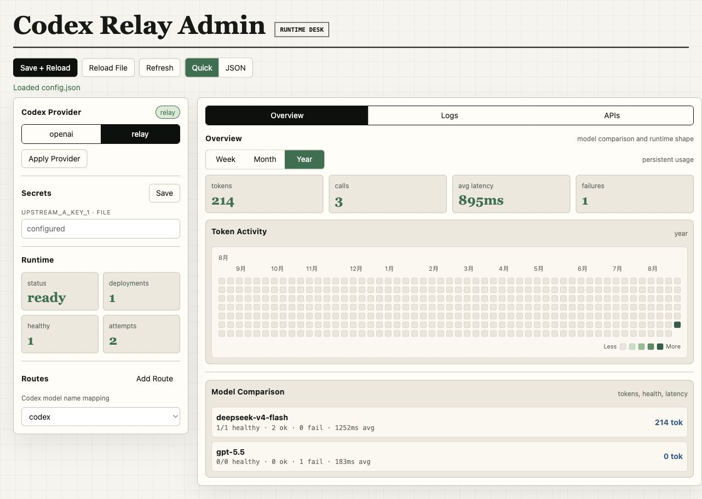
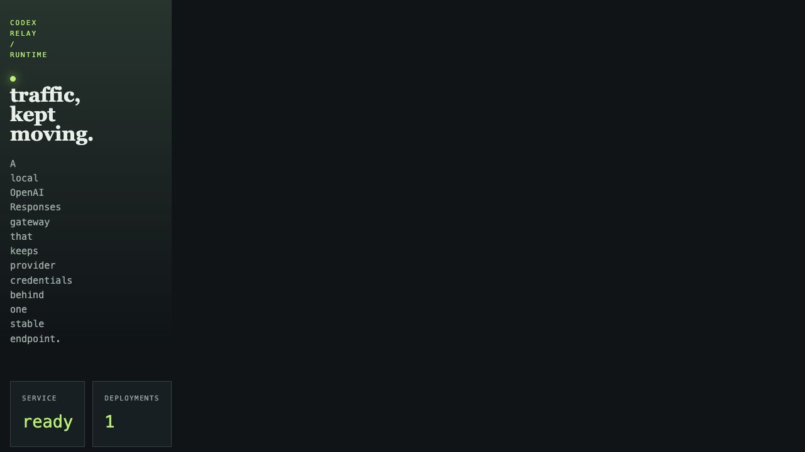

# Codex Relay 用户文档

最后更新：2026-08-23

这是一份给日常使用者看的快速说明。目标很简单：让 Codex 只连一个稳定地址，后面的多个上游 URL 和 API Key 交给中转站自动处理。

## 这是做什么的

你只需要把 Codex 指向本地的 Codex Relay。Relay 会根据配置挑选上游 deployment，并在下面这些情况自动切换：

- 某个 key 余额不足或配额耗尽
- 某个 key 被限流
- 某个上游临时故障、超时或网络不通

你不用手工改 Codex 配置里的 URL，也不用每次出问题都去换 key。

## 多用户 CLI

如果同一台电脑由多个人使用，并且每个人需要自己的 API，可以使用 CLI 账号模式：

```bash
npm run cli register
npm run cli login
npm run cli
```

现在 CLI 是一个可返回的终端控制台，不需要记住数字菜单：

- `↑` / `↓`：移动高亮选中项；
- `Enter`：进入页面、打开记录或确认当前操作；
- `Esc`：返回上一页；编辑过程中按 `Esc` 会取消当前编辑，不保存修改；
- `←` / `→`：在看板切换周/月/年，在日志切换上一页/下一页，在详情切换 Summary/JSON；
- `Ctrl+S`：保存表单；`Ctrl+X`：清空当前字段；`Ctrl+C` 或 `q`：退出。

主页面包含：

- `APIs & keys`：用上下键选择 API，按 `Enter` 编辑，按 `a` 新增，按 `t` 测试，按 `d` 删除并确认；
- `Routes / aliases`：编辑 Codex 可使用的逻辑模型别名；
- `Overview`：按周、月、年查看调用、token、平均延迟和模型对比；
- `Recent logs`：分页查看调用记录，按 `Enter` 打开详情，再按 `j` / `s` 切换 JSON / Summary；
- `Codex provider`：切换 Codex 的 `openai` / `relay`，同时更新 Codex threads 的 provider 字段；
- `Account & session`：设置默认账号、退出当前终端或删除账号；
- `Reload relay`：保存后可直接让运行中的 relay 重新加载当前 profile。

测试 API 时会立即显示 `Testing...`，请求完成后进入结果页，直接展示成功/失败、deployment、真实上游模型、耗时、token usage 和响应预览；测试过程中再次按键不会重复发起请求。

网页管理台左侧的 `Account` 区也提供同等操作：注册、登录、退出到 Guest、设置默认账号和删除账号。账号数据在 `~/.codex-relay/` 下按用户隔离。当前终端的登录 session 优先于默认账号，因此不同终端可以分别登录不同用户。没有当前登录 session、也没有默认账号时，Relay 会使用 `.env` 里的 `RELAY_API_KEY` 作为 Guest；Guest 继续使用项目根目录的 `config.json` 和默认状态文件。登录用户、默认用户和 Guest 的配置、调用日志、状态统计互相隔离。

## 快速开始

### 1. 准备配置文件

```bash
cp config.example.json config.json
```

### 2. 启动服务

```bash
npm start
```

默认会监听 `http://127.0.0.1:8787`。

### 3. 在网页端填写密钥

管理控制台：

```text
http://127.0.0.1:8787/admin
```

第一次启动时，服务会自动生成内部使用的 `RELAY_API_KEY` 和 `RELAY_ADMIN_KEY`。本机打开管理控制台不需要手动填写 Admin Key，默认进入 Guest profile，体验和单用户版本一致。进入后在 Secrets 区域填写上游 API Key：

```dotenv
UPSTREAM_A_KEY_1=your-upstream-key-1
UPSTREAM_A_KEY_2=your-upstream-key-2
UPSTREAM_B_KEY_1=your-upstream-key-3
```

点击 Secrets 区域的 `Save` 后，服务会把这些值写到本地 `.env`，并自动热更新。

`.env` 已经在 `.gitignore` 里，不会被提交。启动时项目会自动读取它。



## 配置 Codex

最简单的方式是在管理控制台左侧切换：

- 选择 `openai`：Codex 使用默认 OpenAI provider，不经过中转站
- 选择 `relay`：Codex 使用 Codex Relay

点击 `Apply Provider` 后，网页端会同时更新：

- `~/.codex/config.toml`
- `~/.codex/state_5.sqlite` 里已有任务的 `model_provider`

如果你点的是顶部 `Save + Reload`，它也会在保存配置后同步当前选中的 `openai` 或 `relay`，所以不必再额外点一次 `Apply Provider`。

切到 `relay` 时，生成的配置类似这样：

```toml
model_provider = "relay"

[model_providers.relay]
name = "Codex Relay"
base_url = "http://127.0.0.1:8787/v1"
wire_api = "responses"

[model_providers.relay.auth]
command = "node"
args = ["/absolute/path/to/scripts/relay-token.mjs", "/absolute/path/to/.env", "RELAY_API_KEY"]
```

这个 auth command 会优先读取当前终端的多用户 session，其次读取免登录默认账号；如果两者都不存在，就从 `.env` 读取 Guest 的内部 relay token，所以不需要手动 `export RELAY_API_KEY`。

## 配置上游 key

在 `config.json` 里，一个 deployment 代表一个“URL + Key + 模型”的组合。

示例：

```json
{
  "id": "provider-a-key-1",
  "provider": "provider-a",
  "base_url": "https://api-a.example.com/v1",
  "model": "gpt-5-codex",
  "api_key": "env:UPSTREAM_A_KEY_1",
  "priority": 10,
  "weight": 1,
  "enabled": true
}
```

建议这样理解：

- `priority` 越小越优先
- 同优先级会按 `weight` 轮转
- 同一个 provider 可以挂多个 key
- 某个 key 失效后，Relay 会自动尝试下一个可用 deployment

在网页端的 Quick 页面，只需要填：

- `API`：可以是真实 key，也可以是 `env:NAME`
- `model_provider`：上游/provider 名称
- `base_url`：上游 OpenAI-compatible `/v1` 地址
- `model`：上游实际模型名

如果只想用某一个 API，点击它的 `Only This`；如果想让多个 API 互为备用，就保持它们都是 `enabled`。

左侧的 `Routes` 是“Codex 模型名映射”。比如 Codex 请求 `codex`，Relay 会先找到这个 route，再从该 route 下面的 API 列表里选择真实上游 `base_url + API key + model`。平时新增上游接口用 `APIs` 里的 `Add API`；只有想新增一个 Codex 可选择的模型名时，才使用 `Add Route`。

## 怎么验证是否可用

先看状态页：



也可以直接检查健康状态：

```bash
curl http://127.0.0.1:8787/healthz
curl http://127.0.0.1:8787/readyz
```

如果你想看当前部署状态：

```bash
curl http://127.0.0.1:8787/api/status/public
```

管理控制台的 `Overview` 可以切换 `Week / Month / Year`。`Year` 是类似 GitHub contribution 的 token 热力图，适合看长期调用活跃度；大数字会自动添加千位分隔符；`Logs` 支持分页，调用多了也不会把页面无限拉长。

### Sessions 页面

管理控制台的 `Sessions` 页面把 Codex 的 `threads` 表和 Relay 的 `recent_calls` 合并展示。只有请求中明确携带了可识别的 `thread_id`，请求才会计入对应 session；没有关联 ID 的调用会显示在 `unlinked` 计数中，不会被猜到某个 session。

页面默认按最近活跃时间排序，也可以按 Requests、RPM 或 Tokens 排序。搜索框支持空格分隔的多个关键词，并采用 AND 逻辑。例如：

```text
dashboard ~/Documents/projects/project deepseek
```

表示同一个 session 必须同时命中 `dashboard`、目录片段和 `deepseek`。搜索字段包含 session 标题、ID、目录、模型、provider、rollout 路径，以及最近请求的 deployment 和 request ID。

RPM 默认按 15 分钟固定窗口计算：

```text
RPM = 最近 15 分钟的请求数 / 15
```

只有 1 个请求时会显示约 `0.07 RPM`，不会被当作瞬时高峰。可以切换 5 分钟或 60 分钟窗口。Session 详情中的 `observed RPM` 用于观察首尾请求之间的 burst 密度，只有 1 个请求时显示为 0。

Sessions 列表会定期刷新，刷新期间不会覆盖正在输入的搜索词；点击 `Refresh` 可以立即更新。列表同时读取 Codex 的 `~/.codex/state_5.sqlite`，默认只显示有 Relay 请求或有 token 使用量的会话，所以不会被从未使用过的空线程淹没。即使某次请求没有携带可关联的 thread ID，只要 Codex 保存了该会话的 token 使用量，仍然可以显示。卡片会标明 token 来源：`Codex tokens` 表示来自 Codex 本地状态，`Relay tokens` 表示来自 Relay 调用记录，`Codex + Relay` 表示两者都存在。点击某个 session 可以查看 RPM、token 总量、rollout 路径和最近 Relay 请求，再点击请求即可打开完整的调用详情。

通过管理鉴权的用户还可以点击顶部的 `Stop Relay` 停止中转服务。按钮会二次确认，并在服务返回确认后优雅关闭监听；未登录用户不能使用。服务停止后，在项目目录执行下面的命令即可后台启动：

```bash
npm run start:background
```

也可以使用前台模式：

```bash
npm run start
```

后台脚本会写入 `.codex-relay.pid` 和 `.codex-relay.log`，重复执行不会启动第二个 Relay，并会从启动日志显示实际管理地址。若使用 launchd、Docker 等外部进程管理器，停止后仍可能被管理器自动拉起。

## 常见用法

### 网页端保存并热更新

访问：

```text
http://127.0.0.1:8787/admin
```

输入管理 key 后，修改 API 或详细 JSON，再点击 `Save + Reload`。保存会先校验配置，校验通过后才覆盖文件、热更新运行时，并同步当前选中的 Codex Provider。

### 重新加载配置

修改 `config.json` 之后，可以不用重启进程，直接热加载。日常建议直接点网页端的 `Save + Reload`；命令行调试时可以这样做：

```bash
source .env
curl -X POST http://127.0.0.1:8787/admin/reload \
  -H "Authorization: Bearer $RELAY_ADMIN_KEY"
```

### 发送请求

Relay 暴露的是 Responses API：

```bash
source .env
curl http://127.0.0.1:8787/v1/responses \
  -H "Authorization: Bearer $RELAY_API_KEY" \
  -H "Content-Type: application/json" \
  -d '{
    "model": "gpt-5-codex",
    "input": "Reply with one short sentence.",
    "stream": false
  }'
```

### 开流式输出

把 `"stream": true` 打开即可：

```bash
source .env
curl -N http://127.0.0.1:8787/v1/responses \
  -H "Authorization: Bearer $RELAY_API_KEY" \
  -H "Content-Type: application/json" \
  -d '{
    "model": "gpt-5-codex",
    "input": "Reply with one short sentence.",
    "stream": true
  }'
```

## 出问题时先看什么

- `401/403`：多半是上游 key 无效
- `402` 或余额类报错：Relay 会自动换下一个 key
- `429`：当前 key 被限流，会进入冷却
- `5xx` 或网络错误：Relay 会尝试其他 deployment
- `ready` 但还是不通：看 `/api/status` 里的具体 deployment 状态

## 小提醒

- 不要把真实上游 key 直接写进 `config.json`
- `RELAY_API_KEY` 和 `RELAY_ADMIN_KEY` 是内部使用的本地 token，会自动生成并在网页端隐藏
- 监听地址和端口改动后需要重启
- token 统计、调用日志和 cooldown 默认保存在 `.codex-relay-state.json`，服务重启后不会丢
- 这是一个本机/同机优先的中转站，不是分布式控制面
